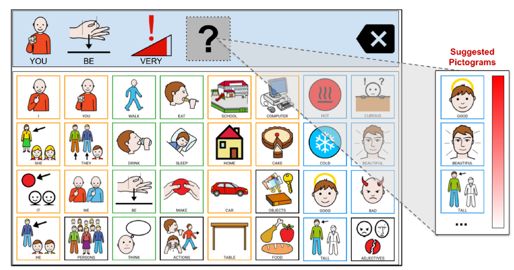

# Continual-Learning-with-Meta-Learning-and-Experience-Replay-
Meta_ER PictoBERT: Enhancing Continual Learning with Meta-Learning and Experience Replay for Personalized Pictogram Recommendations 

Augmentative and Alternative Communication (AAC) boards are Assistive Technology tools that try to compensate for the difficulties faced by people with Complex Communication Needs (CCN), such as people with down’s syndrome, autism spectrum disorder, intellectual disability, cerebral palsy, developmental apraxia of speech, or aphasia
A pictogram is a picture with a label that denotes an action, object, person, animal, or place. Predicting the next pictogram to be set in a sentence in construction is an essential feature for AAC boards to facilitate communication. These tools allow individuals with CCN to communicate themselves by selecting and arranging pictograms in sequence to make up a sentence, as shown in the example illustrated in Fig. 1.

    

[PictoBERT](https://github.com/jayralencar/pictoBERT), an adaptation of BERT for the next pictogram prediction task, with changed input embeddings to allow word-sense usage instead of words, considering that a word-sense represents a pictogram.

Continual learning (CL) aims to adaptively learn across time by leveraging previously learned data to improve generalization for future data.

* Model 1 : Experience Replay
   The model, ER_PictoBERT, is built using PyTorch Lightning and utilizes a pretrained BERT-based architecture (BertForMaskedLM: PictoBERT) for next word prediction tasks.
   It includes an external memory buffer mechanism to store and sample data for continual learning.
   - The `memory buffer` is designed to store past training samples to facilitate experience replay (ER), a technique commonly used in continual learning.
   - ER helps `mitigate catastrophic forgetting`, a common problem in neural networks when they are trained incrementally on new tasks. 
   - The buffer allows the model to remember and rehearse past data, effectively balancing learning between new and old data.

* Model 2 : Meta PictoBERT
    + <b>Base Model</b>: Utilizes the pre-trained BERT model (pictoBERT) designed for masked language modeling, which serves as the foundation for downstream tasks such as understanding and generating natural language text.
    
    + <b>Meta-Learning Framework</b>: The model leverages meta-learning techniques to adapt quickly to new tasks by simulating a scenario where it learns from a smaller dataset (trajectory data) and then evaluates on another set (meta-test data). This approach is designed to improve generalization to new, unseen data.
      - using a meta-learning approach, the model can quickly adapt to new tasks, demonstrating strong generalization capabilities
     
* Model 3 : MetaER_pictobert:

   - <b>Pre-trained BERT for Masked Language Modeling (pictobert)</b>: The model utilizes a pre-trained BERT (pictobert) as its base for encoding text. This provides a powerful foundation of language understanding, which can be fine-tuned for specific tasks.
   - <b>Experience Replay (ER) Memory Buffer</b>:
     + A memory buffer stores past examples from the personalized dataset to continuously retain and replay them during training. This helps the model retain knowledge over time.
     + <i>Memory Buffer Details</i>: The buffer uses a fixed size (`mem_sz = 1000`) and is updated regularly, replacing old samples with new ones as the buffer reaches capacity.

   - <b>Meta-Learning Loop (MAML-Inspired)</b>:
     + The meta-learning loop enables the model to learn how to adapt quickly to new tasks by simulating learning on small datasets (<i>support set</i>) and evaluating on new examples (<i>query set</i>).
     + <b>Inner Loop (Task-Specific Learning)</b>: Updates fast weights (task-specific parameters) using a small subset of data. This loop mimics how the model would learn a new task from limited examples.
     + <b>Outer Loop (Meta-Optimization)</b>: Evaluates the effectiveness of the inner loop’s updates and adjusts the base model parameters (MetaER_pictobert) to enhance adaptability across tasks.
   - <b>Custom Weight Application</b>: A mechanism to dynamically apply custom weights for each layer during the meta-learning process, allowing for flexible updates and fine-tuning.
   - <b>Dynamic Learning Rate and Optimizer</b>: Uses `AdamW optimizer` with `polynomial decay scheduling` to fine-tune the learning process, ensuring better convergence over time.

 # How Meta_ER PictoBERT Helps in the Continual Learning Task for Personalized Pictogram Recommendations:

 A continual learning agent should be able to build on top of existing knowledge to learn on new data quickly while minimizing forgetting.

The combined approach of MAML and Experience Replay in MetaER_pictobert equips the model with the ability to rapidly adapt to new user preferences while retaining past knowledge.
 1. Personalization: It can quickly personalize pictogram recommendations based on minimal user interactions.
 
 2. Generalization: It retains a generalized understanding of various user preferences, making it robust across diverse user groups.

A major challenge with Continual learning is to mitigate `Catastrophic forgetting` which occurs when a model trained sequentially on multiple tasks forgets previous tasks as it learns new ones. MetaER_pictobert addresses this challenge in several ways:

 1. Experience Replay (ER):
    - <i>Memory Buffer for Old Examples</i>: The model maintains a memory buffer that stores examples from past tasks (or user preferences) and regularly replays them during training.
    - <i>Periodic Sampling from Memory</i>: During each training step, the model randomly samples from the memory buffer and combines these samples with new data. This ensures that the model retains knowledge of past tasks while learning from new data.
    - <i>How This Prevents Forgetting</i>: By continually revisiting old examples, the model prevents the parameters from drifting too far from what was optimal for past tasks, mitigating catastrophic forgetting.

 2. MAML-Inspired Meta-Learning:
    - <i>Learned Initialization</i>: The MAML approach learns an initialization of parameters that are effective for rapid adaptation to a wide range of tasks. It trains the model’s parameters such that a small number of gradient updates will lead to fast learning on a new task.
    - <i>Inner Loop Updates (Task-Specific Fine-Tuning)</i>: When learning new tasks, the model only fine-tunes a small number of gradient steps, which prevents excessive overwriting of the base parameters.
    - <i>Outer Loop Updates (Meta-Optimization)</i>: Meta-optimization ensures that the base parameters remain robust and general, preserving knowledge that is broadly useful across tasks.

 3. Balanced Training Strategy:

    - <i>Combining Mini-Batches</i>: The model combines current mini-batches with samples drawn from the memory buffer, ensuring that it is trained on both new and historical data. This reduces the risk of overfitting to recent data or losing valuable information learned earlier.
    - <i>Task-Specific Learning (Inner Update)</i>: The task-specific learning process ensures that each new task is adapted with minimal changes to the core parameters, which are meta-optimized to be adaptable yet stable.

 4. Custom Weight Application and Dynamic Updates:

    - <i>Dynamic Weight Application</i>: By dynamically applying weights during the meta-learning loop, the model achieves finer control over which parameters are updated, further reducing the risk of forgetting.
      
    - <i>Efficient Memory Management</i>: The cyclic replacement strategy in the memory buffer allows the model to maintain a diverse set of training examples over time, which is crucial for preventing forgetting in a continual learning scenario.
   
# Evaluation

    

 

    Fig. 2 Prediction Samples

 

  - Enhanced adaptability and performance in the continual learning task, resulting in an 87.43% reduction in loss and 13.31% decrease in perplexity compared to traditional methods.
    
  - Advanced techniques such as fast gradient updates and memory buffer sampling enabled efficient learning across tasks  with minimal forgetting, achieving a test loss of 3.66 and perplexity of 48.78 on thecomplex datasets, showcasing significant improvement in model generalization.

